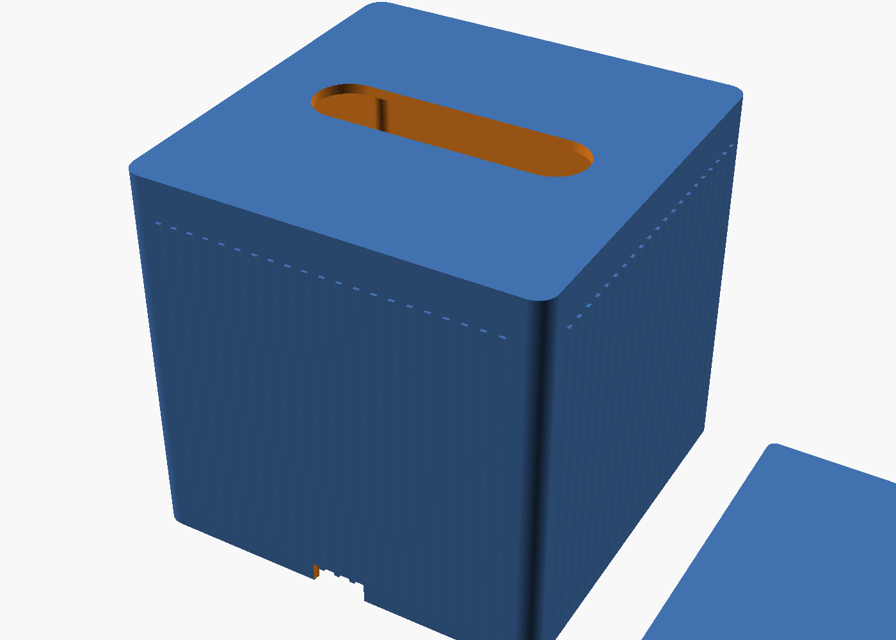

# Tissue Box Holder (square Kleenex box)

A 3D-printable two-part holder for a square/cube Kleenex-style tissue box:

- **Sleeve** — smooth, solid top with a rounded oval pull slot, vertically
  ribbed sides (thin stripes), smooth rounded corners, open bottom.
- **Base plate** — a separate piece that slides in from the bottom and
  snaps under an internal ridge, so it holds the box in but pops in/out by
  hand with no tools or fasteners.

## Files

- `tissue-box-holder.scad` — parametric OpenSCAD source (edit this to fit your box)
- `tissue-box-holder-sleeve.stl` — ready-to-slice sleeve, sized for a 124×124×124mm box
- `tissue-box-holder-base.stl` — ready-to-slice base plate, matching the sleeve above

If your box is a different size, open the `.scad` file in
[OpenSCAD](https://openscad.org/) (free), edit `box_w` / `box_d` / `box_h`
at the top to match your box's actual measurements, then re-export the STLs
(see below).

## Customizing

All dimensions are parameters at the top of `tissue-box-holder.scad`:

1. Measure your box's width, depth, and height and set `box_w`, `box_d`, `box_h`.
2. Set the `part` variable to `"sleeve"`, `"base"`, or `"both"` (preview only).
3. Press F5 to preview, F6 to render, then File > Export > Export as STL.
4. Export the sleeve and base separately (STL export only works with one
   solid selected — that's what the `part` variable controls).

Other things worth tuning:

- `rib_width` / `rib_gap` / `rib_depth` — stripe size/spacing on the sides.
- `slot_length` / `slot_width` — the top pull-slot size.
- `ridge_protrusion` / `base_fit_gap` — how firmly the base plate snaps in.
  The effective engagement is `ridge_protrusion - base_fit_gap`; keep that
  around 0.3–0.4mm for an easy hand snap, more (~0.6mm+) for a firmer hold.

## Printing

- 0.4mm nozzle, 0.2mm layer height, 3+ perimeters.
- PLA or PETG. Avoid heavily-filled/brittle filaments — the base plate
  relies on the sleeve walls flexing a small amount to snap in and out.
- No supports needed for either part.
- Print both parts standing as oriented in the STL (sleeve opening down,
  base plate flat) — the tissue slot and ribs come out clean without supports.

## Assembly

1. Slide the tissue box up into the sleeve from the open bottom (the smooth
   top with the pull slot goes on top).
2. Push the base plate up into the open bottom from below — the two small
   thumb notches on the front/back bottom edge give your fingers access to
   push it into place. The plate snaps under an internal ridge and holds
   the box up.
3. To remove/replace the tissue box, reach into the thumb notches and pull
   the base plate straight down; it snaps back out the same way it went in.
