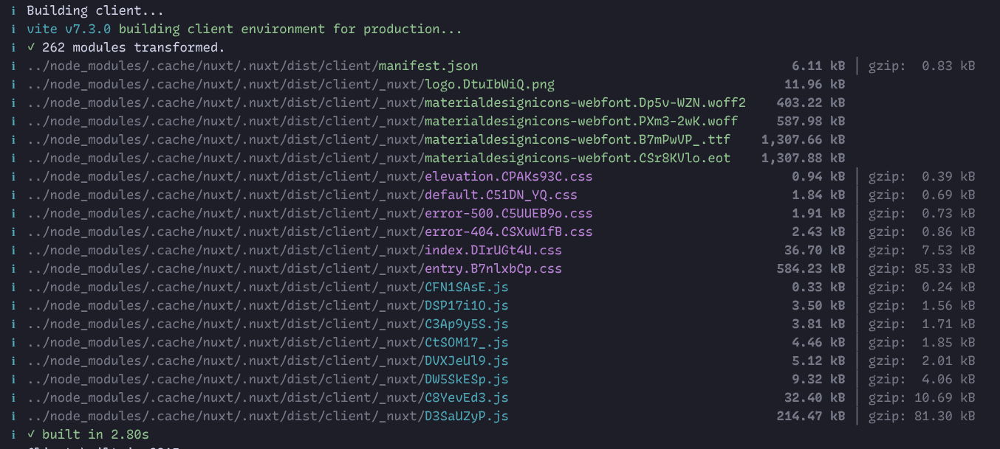

# Creating a highly optimized Vuetify project with Nuxt and UnoCSS

Although traditionally we tend to think about Vuetify as a great fit for large projects, it can also serve smaller projects that tend to prioritize performance. When scaffolding new projects it comes with tree-shaking out-of-the-box, but there is still some room for improvement as main CSS bundle ships hundreds of kB of CSS we might not need. If the users like your page loading animation and you can afford a bit of overhead, there is nothing wrong with simplified setup that does the job and let's you focus on the business logic or UX. That said, integrating UnoCSS (atomic CSS engine) will help us trim the bundle and enable dynamic utilities. With it's superpowers we not only avoid writing plain CSS (most of the time), but can also make use of TailwindCSS tooling (IDE extensions) or standardize certain utilities.

The article will walk through scaffolding a starter project, installing and wiring UnoCSS, customizing fonts, handling light/dark mode and aligning breakpoints. Finally, “CSS layers” section shows how to order Vuetify, UnoCSS, and app‑specific styles to avoid specificity conflicts.

---

## Table of Contents

* [The steps ahead](#the-steps-ahead)
* [Scaffold a new project](#scaffold-a-new-project)
* [Keep an eye on the outputs](#keep-an-eye-on-the-outputs)
* [Disable CSS for utilities and standard colors](#disable-css-for-utilities-and-standard-colors)
  * [Shortest way to setup UnoCSS](#shortest-way-to-setup-unocss)
  * [Migrating to utilities from TailwindCSS v4](#migrating-to-utilities-from-tailwind-css-v4)
  * [Resolve specificity issues (quickly)](#resolve-specificity-issues-quickly)
  * [Font family configuration](#font-family-configuration)
  * [Light/dark mode compatibility](#light-dark-mode-compatibility)
  * [Custom typography (text variants)](#custom-typography-text-variants)
  * [Customize breakpoints](#customize-breakpoints)
* [Using CSS layers](#using-css-layers)

---

## The steps ahead

Right after generatig starter project we are going to disable all CSS for non-theme colors (Material colors palette) and CSS utilities. This leaves out styles for "reset", transitions and components. UnoCSS is going to generate them on the fly making sure we only bundle CSS we actually use.

Along the way we will keep in mind that successful integration has to correctly match following aspects:

- themes (light / dark mode)
- custom typography
- responsive breakpoints

Lastly, we will enable CSS layers to estabilish order. This part is meant for advanced frontend developers and teams that have a solid knowledge of CSS and the layers can impact day to day work. It is not a free lunch and it might not always fit the workflow or the way you write CSS.

## Scaffold a new project

::: tabs

```bash [pnpm]
pnpm create vuetify
```

```bash [yarn]
yarn create vuetify
```

```bash [npm]
npm create vuetify
```

```bash [bun]
bun create vuetify
```

:::

...choose "Nuxt Recommended". Following questions don't matter much.

Start the project on localhost

::: tabs

```bash [pnpm]
pnpm dev
```

```bash [yarn]
yarn dev
```

```bash [npm]
npm run dev
```

```bash [bun]
bun run dev
```

:::

## Keep an eye on the outputs

Nuxt uses Vite under the hood to build assets for production. Sizes are all layed out in the logs.

::: tabs

```bash [pnpm]
pnpm build
```

```bash [yarn]
yarn build
```

```bash [npm]
npm run build
```

```bash [bun]
bun run build
```

:::



Anytime you build the project, bundle files are right there in the `.output/public/_nuxt` directory. The CSS bundle file named `entry{hash}.css` is one that might be particularly interesting.

::: tip
When inspecting bundles, keep in mind VSCode might refuse to format large files, freeze or even crash. I recommend Zed editor for the optimal experience.
:::

## Disable CSS for utilities and standard colors

Create the `app/assets/main.scss` and paste:

```scss
@use 'vuetify' with (
  $color-pack: false,
  $utilities: false,
);
```

New file has to be referenced or imported. Go ahead and include it in `nuxt.config.ts`

```ts
  css: [
    "assets/main.scss",
  ],
```

...and add/uncomment `vuetify-nuxt-module` configuration flag:

```ts
  vuetify: {
    moduleOptions: {
      // ...
      disableVuetifyStyles: true, // <-- uncomment this line
    },
  },
```

If you run `pnpm build` again, you may observe that `entry.*.css` bundle is nearly 2 times smaller. We could get even further by replacing MDI font icons with SVG icons or UnoCSS icons "preset", but it is out of scope for this article.

### Shortest way to setup UnoCSS

::: tabs

```bash [pnpm]
pnpm add -D unocss unocss-preset-vuetify @unocss/nuxt
```

```bash [yarn]
yarn add -D unocss unocss-preset-vuetify @unocss/nuxt
```

```bash [npm]
npm i -D unocss unocss-preset-vuetify @unocss/nuxt
```

```bash [bun]
bun add -D unocss unocss-preset-vuetify @unocss/nuxt
```

:::

Register the module in `nuxt.config.ts` and paste initial configuration nearby:

```ts
import { presetVuetify } from 'unocss-preset-vuetify'

export default defineNuxtConfig({
  // ...

  modules: [
    '@unocss/nuxt',
    //... keep other modules
  ]

  // vuetify: { ... }

  unocss: {
    presets: [
      presetVuetify(),
    ],
  },
})
```

TODO: comment...

### Migrating to utilities from TailwindCSS v4

::: tabs

```bash [pnpm]
pnpm remove unocss-preset-vuetify
pnpm add -D @unocss/preset-wind4
```

```bash [yarn]
yarn remove unocss-preset-vuetify
yarn add -D @unocss/preset-wind4
```

```bash [npm]
npm un unocss-preset-vuetify
npm i -D @unocss/preset-wind4
```

```bash [bun]
bun remove unocss-preset-vuetify
bun add -D @unocss/preset-wind4
```

:::

```diff
-import { presetVuetify } from 'unocss-preset-vuetify'
+import presetWind4 from '@unocss/preset-wind4'

export default defineNuxtConfig({
  // ...
  unocss: {
    presets: [
-      presetVuetify(),
+      presetWind4({
+        preflights: {
+          reset: false,
+        },
+      }),
    ],
  },
})
```

The code above ensures we use only CSS reset from Vuetify and won't experience conflicts.

We can finish this part with small adjustment to the example content in `HelloWorld.vue` and `AppFooter.vue`

- replace `fill-height` with `h-full`
- replace `font-weight-` with `font-`
- replace `mb-n1` with `-mb-1`

Optionally replace typography classes if you intend to use utilities from TailwindCSS. These are the closest equivalents (for the font size only):

- `text-h2` » `text-5xl`
- `text-h5` » `text-2xl`
- `text-subtitle-1` » `text-base`
- `text-body-2` » `text-sm`

Turns out `v-container` paired with `fill-height` class gets special additional styles when `v-row` is also on the page. So we need to add some more utility classes to move the content to the center:

```html
  <v-container class="h-full flex items-center" max-width="900">
```

There is one more component that relies on utility classes - `v-row`. Convenient props named `justify` and `align` rely on the utilitity classes for CSS properties `justify-content` and `align-items` respectively. TailwindCSS won't detect them though and even if we could force it to generate them, the classes in TailwindCSS are named slightly differently (e.g. `justify-space-between` vs `justify-between`). There are couple of ways to get around it.

- just paste the classes in any CSS/SCSS file meant for global styles (e.g. `main.scss`)
- spread `$utilites` to selectively disable most of them while keeping `justify-content` and `align-items`
- don't use VRow/VCol or ban just those two problematic props (can be achieved by patching `vuetify-eslint-plugin`)

If you go with the first option, you can copy the classes below.

```css
.justify-start { justify-content: flex-start }
.justify-end { justify-content: flex-end }
.justify-center { justify-content: center }
.justify-space-between { justify-content: space-between }
.justify-space-around { justify-content: space-around }
.justify-space-evenly { justify-content: space-evenly }

.align-start { align-items: flex-start }
.align-end { align-items: flex-end }
.align-center { align-items: center }
.align-baseline { align-items: baseline }
.align-stretch { align-items: stretch }
```

Second option is trading hardcoded styles for some noise in the Sass configuration.

```scss
$utilities: (
  "align-items": (responsive: false, unimportant: (align-items)),
  "justify-content": (responsive: false, unimportant: (justify-content)),
  // followed by 80+ lines with all other utilities set to `false`
  // full list: https://vuetifyjs.com/en/features/sass-variables/#disabling-utility-classes
)
```

The important thing to note here is that we did not use CSS layers so you might see that utility classes from TailwindCSS do not override default styles. An example would be:

```html
<v-card class="h-[120px] flex items-center">...</v-card>
```

Something that is not really noticable at first glance is the card rounding. `rounded="lg"` is not recognized by UnoCSS with TailwindCSS preset and `.rounded-lg` class won't appear in the output CSS.

```css
.rounded-0 { border-radius: 0 }
.rounded-sm { border-radius: 2px }
.rounded { border-radius: 4px }
.rounded-lg { border-radius: 8px }
.rounded-xl { border-radius: 24px }
.rounded-pill { border-radius: 9999px }
.rounded-circle { border-radius: 50% }
.rounded-shaped { border-radius: 24px 0 }
```

or

```scss
$utilities: (
  // ...
  "rounded": (responsive: false, unimportant: (border-radius)),
  // ...
)
```

Did I mention we have the same problem with `border`? ...ugh... same story, let's move on.

### Resolve specificity issues (quickly)

In our current configuration order in which the styles are loaded matters - which might make our application look differently after deployment, as usually Vite "just loads" assets when working on localhost. This means the order may be quite different for the production bundle.

Usually the easiest fix would be to make UnoCSS generate all the styles with `!important`. This would make them equivalent to original Vuetify utility classes that all had `!important` by default. It is not very elegant, but get's the job done and is easy to reason about. If you are interested in using CSS layers instead, skip to the [final]((#using-css-layers)) part of this article.

```diff
unocss: {
  presets: [
    presetWind4({
+      important: true, // <-- utility classes always win
      preflights: { ... },
    }),
  ],
},
```

### Font family configuration

To customize fonts we will rely on `@nuxt/fonts` to minimize the amount of configuration required to set up custom font family. Beware it scans the output CSS - doing a magic trick similar to TailwindCSS, but for the fonts. So you might want to inspect the build logs and make sure there is no mention of Roboto after applying the changes described below.

```diff
  unocss: {
    presets: [ ... ],
+    theme: {
+      font: {
+        heading: "'Bricolage Grotesque', sans-serif",
+        body: "Sen, sans-serif",
+        mono: "'Sometype Mono', monospace",
+      },
+    },
  },
+  fonts: {
+    defaults: {
+      weights: [300, 400, 500, 700],
+      styles: ["normal", "italic"],
+      subsets: ["latin"],
+    },
+  },
```

```scss
@use 'vuetify' with (
  $heading-font-family: var(--font-heading),
  $body-font-family: var(--font-body),
  // ...
);

code,
pre,
.v-code {
  font-family: var(--font-mono);
}
```

> TODO: how can we force UnoCSS to generate those variables even if it does not find `.font-{type}` classes? This would let us pass those variables to Sass and avoid duplication

### Light/dark mode compatibility

Let's add some colors and try using `dark:*` prefix for some classes to see what happens.

```diff
unocss: {
  //...
  theme: {
    font: { ... },
    colors: {
+     primary: {
+       800: '#003256',
+     },
+     secondary: {
+       600: '#00677e',
+       800: '#003543',
+     }
    },
  },
},
```

Now we can try ` dark:bg-primary-800` to one of the cards, and `dark:bg-linear-to-r dark:from-secondary-800 dark:to-secondary-600` to another.

In order to toggle themes we can add a quick button in the corner of the page. Simply paste the following code anywhere (e.g. in `default.vue` layout file).

```html
<v-btn
  :icon="`svg:${mdiThemeLightDark}`"
  position="absolute"
  location="top right"
  class="ma-2"
  @click="$vuetify.theme.cycle()"
/>
```

```ts
import { mdiThemeLightDark } from '@mdi/js'
```

> When adding new colors in `nuxt.config.ts` you might need to occasionally restart the Dev server.

Hm... toggling dark mode does not apply the background and gradient from classes generated by UnoCSS.

Upon inspection of Elements tab in the browser DevTools, we can find the generated code by seaching for `.dark\:`

```css
.dark .dark\:from-secondary-800{ ... }
.dark .dark\:to-secondary-600{ ... }
.dark .dark\:bg-linear-to-r{ ... }
```

What we actually want there is `.v-theme--dark` not `.dark`.

To align UnoCSS with Vuetify we need add some more code inside `presetWind4({ ... })`

```diff
unocss: {
  presets: [
    presetWind4({
      preflights: { ... },
+     dark: {
+       dark: '.v-theme--dark',
+       light: '.v-theme--light',
+     },
```

### Custom typography (text variants)

> If you intend to fully rely on TailwindCSS classes or have some specific typography requirements, you can skip no the next part.

Let's add a quick preview page for all the typography options that used to be provided by Vuetify.

```html
<template>
  <v-container class="page" max-width="800">
    <div class="flex flex-wrap sm:justify-center gap-6 mt-12">
      <div class="flex-grow-1">
        <div v-for="[name, cls] in headings" :key="name" class="my-1 pa-2 hover:bg-gray-500/20">
          <div :class="[cls, 'py-2']">{{ name }}</div>
          <div class="pb-2">
            <v-code class="font-medium px-2 bg-gray-500/20">{{ cls }}</v-code>
          </div>
        </div>
      </div>
      <div class="flex-grow-1">
        <div v-for="[name, cls] in bodyText" :key="name" class="my-1 pa-2 hover:bg-gray-500/20">
          <div :class="[cls, 'py-2']">{{ name }}</div>
          <div class="pb-2">
            <v-code class="font-medium px-2 bg-gray-500/20">{{ cls }}</v-code>
          </div>
        </div>
      </div>
    </div>
  </v-container>
</template>

<script setup lang="ts">
const headings = [
  ['Heading 1', 'text-h1'],
  ['Heading 2', 'text-h2'],
  ['Heading 3', 'text-h3'],
  ['Heading 4', 'text-h4'],
  ['Heading 5', 'text-h5'],
  ['Heading 6', 'text-h6'],
]
const bodyText = [
  ['Subtitle 1', 'text-subtitle-1'],
  ['Subtitle 2', 'text-subtitle-2'],
  ['Body 1', 'text-body-1'],
  ['Body 2', 'text-body-2'],
  ['Button', 'text-button'],
  ['Caption', 'text-caption'],
  ['Overline', 'text-overline'],
]
</script>
```

We can see none of the usual helper classes work because we disabled `$utilities`. Theoretically we could opt out more granularly, but those classes won't work with responsive prefixes (`sm:*`, `md:*`, etc) - by default they are generated with responsive variants stuffed in the middle (e.g. `*-sm-*`, `*-md-*`, etc.). Having both conventions may be considered an unnecessary mental overhead, so the recommended approach would is to recreate the helpers in UnoCSS configuration `shortcuts`.

Following configuration is aligned with defaults from Vuetify v3.11.x

```ts
unocss: {
  presets: [ ... ],
  theme: { ... },
  shortcuts: {
    'text-h1': 'font-heading normal-case text-[6rem]     font-[300] leading-[1]     tracking-[-.015625em]',
    'text-h2': 'font-heading normal-case text-[3.75rem]  font-[300] leading-[1]     tracking-[-.0083333333em]',
    'text-h3': 'font-heading normal-case text-[3rem]     font-[400] leading-[1.05]  tracking-[normal]',
    'text-h4': 'font-heading normal-case text-[2.125rem] font-[400] leading-[1.175] tracking-[.0073529412em]',
    'text-h5': 'font-heading normal-case text-[1.5rem]   font-[400] leading-[1.333] tracking-[normal]',
    'text-h6': 'font-heading normal-case text-[1.25rem]  font-[500] leading-[1.6]   tracking-[.0125em]',
    'text-subtitle-1': 'font-body normal-case text-[1rem]    font-[400] leading-[1.75]  tracking-[.009375em]',
    'text-subtitle-2': 'font-body normal-case text-[.875rem] font-[500] leading-[1.6]   tracking-[.0071428571em]',
    'text-body-1':     'font-body normal-case text-[1rem]    font-[400] leading-[1.5]   tracking-[.03125em]',
    'text-body-2':     'font-body normal-case text-[.875rem] font-[400] leading-[1.425] tracking-[.0178571429em]',
    'text-button':     'font-body uppercase   text-[.875rem] font-[500] leading-[2.6]   tracking-[.0892857143em]',
    'text-caption':    'font-body normal-case text-[.75rem]  font-[400] leading-[1.667] tracking-[.0333333333em]',
    'text-overline':   'font-body uppercase   text-[.75rem]  font-[500] leading-[2.667] tracking-[.1666666667em]',
  },
},
```

### Customize breakpoints

Default breakpoints provided by TailwindCSS preset are not compatible with Vuetify. Leaving this issue unattended might lead to unnecessary headaches down the road, so let's tackle the issue and make sure we keep it under control.

However, unlike other aspects it is more challenging to have a squicky cleanup with a single definition. It is true with Vuetify even without integrating it with Uno or Tailwind. When I customize vanilla Vuetify project I end up having duplication and some comments that remind me of it.

- `main.scss` - breakpoints within `@use 'vuetify' with (...)` for CSS utilities
- `settings.scss` - breakpoints within `@use 'vuetify/settings' with (...)` for VContainer and VCol
- general Vuetify configuration `display` » `thresholds` for responsive logic in some components, `useDisplay` and `$vuetify.display.*`

Since we fully replaced CSS utilities, we won't need breakpoints in `main.scss`. It will also be cleaner if define it in a separate TS file and to be imported for both main Vuetify configuration and UnoCSS, so we will end up with 2 places to maintain. As a side-note, integration with TailwindCSS v4 (without UnoCSS) would mean we are back with 3 definitions, because latest TailwindCSS expects pure CSS variables. Anyway, enought talking - let's jump right into the code.

Create `breakpoints.ts` under `./app/theme` (create new `theme` folder) with the following content:

```ts
import type { DisplayThresholds } from "vuetify"

// repeated in settings.scss
const breakpoints: DisplayThresholds = {
  xs: 0,
  sm: 400,
  md: 840,
  lg: 1145,
  xl: 1545,
  xxl: 2138,
}

export const forVuetify = breakpoints

export const forTailwind = Object.entries(breakpoints)
  .reduce(
    (o, [key, value]) => ({ ...o, [key]: `${value}px` }),
    {} as Record<keyof DisplayThresholds, string>,
  )
```

Import and apply it to both Vuetify in UnoCSS in `nuxt.config.ts`

```diff
+import * as breakpoints from './app/theme/breakpoints'

export default defineNuxtConfig({
  // ...

  unocss: {
    presets: [ ... ],
    theme: {
      font: { ... },
      colors: { ... },
+     breakpoint: breakpoints.forTailwind,
    },
    shortcuts: { ... },
  },

  vuetify: {
    moduleOptions: { ... },
+   vuetifyOptions: {
+     display: {
+       mobileBreakpoint: "md",
+       thresholds: breakpoints.forVuetify,
+     },
+   }
  },
```

Now adjust the SCSS variables for Vuetify. Note that as of `v3.11.2 ` the `$container-max-widths` would be calculated without rounding the values. I prefer those values to be stable

```scss
@use 'vuetify/settings' with (
  $grid-breakpoints: (
    // repeated in breakpoints.ts
    'xs': 0,
    'sm': 400px,
    'md': 840px,
    'lg': 1145px,
    'xl': 1545px,
    'xxl': 2138px,
  ),
  $container-max-widths: (
    // manually calculated (optional after https://github.com/vuetifyjs/vuetify/pull/19759)
    'md': 700px,
    'lg': 1000px,
    'xl': 1400px,
    'xxl': 2000px,
  ),
);
```

The important next step is to verify the changes. I recommend creating and keeping a hidden technical page that will help verify changes or quickly troubleshoot the regression. Here is what you can paste into `app/pages/breakpoints.ts`:

```html
<template>
  <v-container ref="container" class="mt-12 outline-dashed">
    <v-sheet class="mx-auto pa-6" max-width="400">
      <v-table>
        <tbody>
          <tr>
            <td>Viewport width</td>
            <td class="text-right">
              <v-code>{{ $vuetify.display.width }}px</v-code>
            </td>
          </tr>
          <tr>
            <td>Breakpoint</td>
            <td class="text-right">
              <v-code>{{ $vuetify.display.name }}</v-code>
            </td>
          </tr>
          <tr>
            <td>VContainer width</td>
            <td class="text-right">
              <v-code v-if="container">{{ container.$el.clientWidth }}px</v-code>
            </td>
          </tr>
        </tbody>
      </v-table>
      <br>
      <v-row wrap dense>
        <v-col
          v-for="i in 12" :key="i"
          cols="12" sm="6" md="4" lg="3" xl="2" xxl="1"
        >
          <div
            class="
              bg-red-500/50
              sm:bg-lime-500/50
              md:bg-sky-500/50
              lg:bg-amber-500/50
              xl:bg-teal-500/50
              xxl:bg-pink-500/50
              text-white/80
              xxl:text-transparent
              text-center
            "
          >VCol</div>
        </v-col>
      </v-row>
    </v-sheet>
  </v-container>
</template>

<script setup lang="ts">
const container = useTemplateRef('container')
</script>
```

Restart the Dev server and open `localhost:3000/breakpoints`.

## Using CSS layers

> TODO: link external learning resources + examples to explain the impact

You have to include `$layers: true` in both `main.scss` and `settings.scss`

```diff
@use 'vuetify' with (
+ $layers: true,
```

```diff
@use 'vuetify/settings' with (
+ $layers: true,
```

The first one covers CSS reset, base styles, transitions and utilities. The second one ensures `@layer vuetify.components { ... }` wraps styles for regular components.

Update Vuetify configuration to enable `@layers` for themes - CSS that is generated at runtime and injected into document `<head>`.

```diff
  theme: {
+   layers: true,
    defaultTheme: "dark",
    themes: {
      dark: { ... },
      light: { ... },
```

Finally we update UnoCSS configuration

```diff
unocss: {
  presets: [ ... ],
+ layers: {
+   'uno.properties': -1,
+   'uno.shortcuts': 0,
+   'uno.theme': 1,
+   'uno.utilities': 2,
+ },
+ outputToCssLayers: {
+   cssLayerName: (layer) => `uno.${layer}`
+ },
  theme: { ... },
  shortcuts: { ... },
},
```

You can now utilize them to manage overrides without fighting specificity.
For example:

```css
@layer vuetify.base {
  code, pre, .v-code {
    font-family: var(--font-mono);
  }
}
```

When it comes to regular development, you should define layers you intend make sense for your app size. For medium projects I tend to start with no-brainer split into `base`, `components`, and custom `utilities`.

```css
@layer app {
  @layer base, components, utilities;
}
```

Here are some examples that help visualize the purpose of each group.

```css
@layer app.base {
  .page {
    padding: 0 2rem 4rem;

    &__header {
      padding: 2rem 0 1rem;
    }
  }

  * {
    scrollbar-width: thin;
    scrollbar-color: #888a #8882;
  }
}


@layer app.utilities {
  .force-center {
    display: grid;
    place-items: center;
  }

  .flex-expand-even {
    display: flex;
    > * {
      flex: 1;
    }
  }
}
```

`@layer app.components { ... }` is meant to go into `<style>` of reusable components. Remember to drop the `scoped` and ensure components have unique classes to wrap the styles.

```css
<style>
@layer app.components {
  .my-sortable-list { ... }
}
</style>
```

> TODO: summary

---

TODO: announce future follow-up posts

- Setup with Vite and pure TailwindCSS
- Optimizing icons and reaching 100% of Lighthouse score
